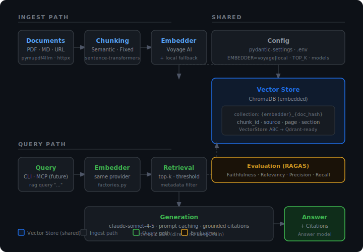

# rag_design

A hand-rolled RAG (Retrieval-Augmented Generation) pipeline built from first principles. No LangChain or LlamaIndex — clean hexagonal architecture with swappable ports and adapters.

Knowledge tool for AI backend design decisions. Ingest technical documents, query them with natural language, get grounded answers with citations.

## Architecture



Two execution paths share a single vector store. The **ingest path** loads documents, chunks them semantically, embeds them, and stores vectors. The **query path** embeds the question, retrieves the top-k chunks, and passes them to Claude as grounded context.

Key decision: only `factories.py` knows concrete adapter names. Everything else depends on ABCs. Swapping Voyage → local embedder is one env var, no code edits.

## Setup

Requires Python 3.12+ and [uv](https://github.com/astral-sh/uv).

```bash
uv sync
cp .env.example .env
# Add ANTHROPIC_API_KEY and VOYAGE_API_KEY (or set EMBEDDER=local)
```

## Usage

```bash
# Ingest a document (PDF, Markdown, or URL)
rag ingest data/raw/book.pdf

# Query the knowledge base
rag query "What is the difference between semantic and keyword search?"

# Run RAGAS evaluation
rag eval --golden data/golden_set.json
```

Evaluation thresholds: faithfulness > 0.90 · answer_relevancy > 0.85 · context_precision > 0.80 · context_recall > 0.75

## License

[PyMuPDF](https://pymupdf.readthedocs.io/) (`pymupdf4llm`) is **AGPL-3.0**. For commercial use, a separate license from Artifex is required. All other dependencies are MIT or Apache 2.0.
